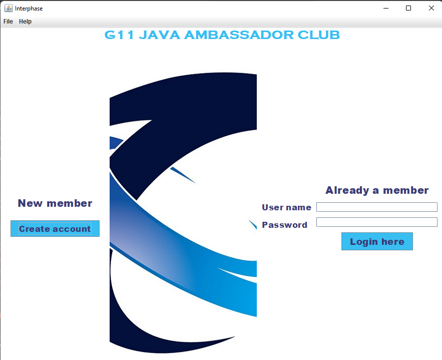
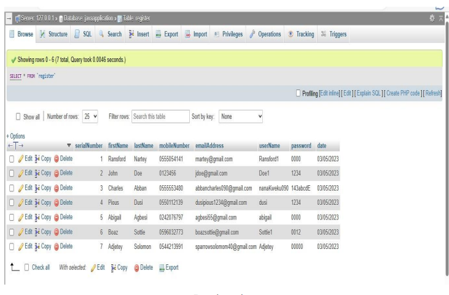
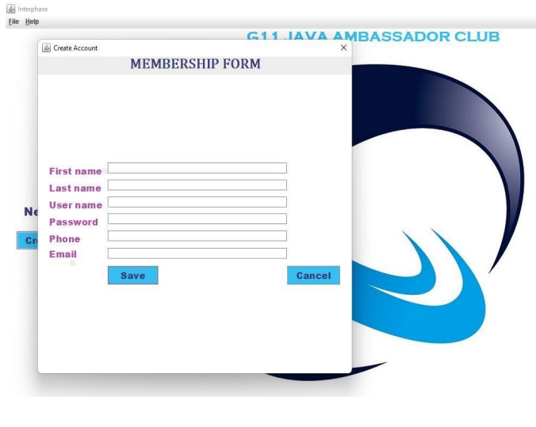

# End-of-semester-Java-project
 Interface

## THE BUILD APPROACH 
The executives of Java Ambassadors Club have contracted your group to design and implement a standalone Club Membership Application.
Using AWT, Swing components, Java Database Connectivity and XAMPP, design and implement the application with the following details;

1. Application should allow members to create an account and register.
2. Application should allow registered members to login.
3. Create a database to hold registered members.
4. Application should ensure that no name can appear more than once using an Exception.
5. Application should show a list of registered members when login.
    - **Delete Button**: removes selected members from the list
    - **Search Button**: search for a registered member
6. Add two **JMenus**: **File** and **Help** with **mnemonics**
7. File Menu contains three **JMenuItems** with **accelerators**
   - **Open** - click to load list of registered members
   - **Exit** - click to exit application
8. Help Menu contains "**About**," a JWindow to display "**copyright information**" when clicked.
   - copyright information
   - Name of Group Members:
   - Index number:
   - Course title:
   - Academic year:

   Schema

   Registration form
   

